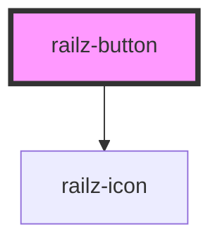

# railz-button

<!-- Auto Generated Below -->

## Properties

| Property     | Attribute     | Description | Type      | Default     |
| ------------ | ------------- | ----------- | --------- | ----------- |
| `grow`       | `grow`        |             | `boolean` | `undefined` |
| `href`       | `href`        |             | `string`  | `undefined` |
| `icon`       | `icon`        |             | `string`  | `undefined` |
| `isDisabled` | `is-disabled` |             | `boolean` | `undefined` |
| `label`      | `label`       |             | `string`  | `undefined` |
| `loading`    | `loading`     |             | `boolean` | `undefined` |
| `shape`      | `shape`       |             | `string`  | `'rounded'` |
| `size`       | `size`        |             | `string`  | `'medium'`  |
| `type`       | `type`        |             | `string`  | `'primary'` |

## Events

| Event         | Description | Type               |
| ------------- | ----------- | ------------------ |
| `buttonClick` |             | `CustomEvent<any>` |

## Dependencies

### Depends on

- [railz-icon](../railz-icon)

### Graph

---

_Built with [StencilJS](https://stenciljs.com/)_
