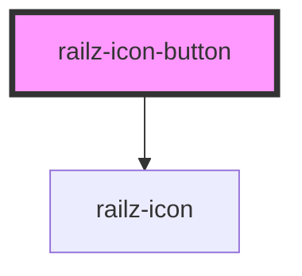

# railz-icon-button

<!-- Auto Generated Below -->

## Properties

| Property   | Attribute  | Description | Type      | Default     |
| ---------- | ---------- | ----------- | --------- | ----------- |
| `disabled` | `disabled` |             | `boolean` | `undefined` |
| `icon`     | `icon`     |             | `string`  | `undefined` |
| `label`    | `label`    |             | `string`  | `undefined` |
| `loading`  | `loading`  |             | `boolean` | `undefined` |
| `shape`    | `shape`    |             | `string`  | `'rounded'` |
| `size`     | `size`     |             | `string`  | `'medium'`  |

## Dependencies

### Depends on

- [railz-icon](../railz-icon)

### Graph

----------------------------------------------

*Built with [StencilJS](https://stenciljs.com/)*
