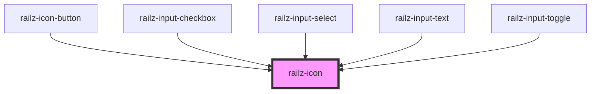

# railz-icon

<!-- Auto Generated Below -->

## Properties

| Property      | Attribute      | Description | Type     | Default     |
| ------------- | -------------- | ----------- | -------- | ----------- |
| `icon`        | `icon`         |             | `string` | `null`      |
| `initialSize` | `initial-size` |             | `number` | `16`        |
| `size`        | `size`         |             | `string` | `undefined` |

## Dependencies

### Used by

 - [railz-icon-button](../railz-icon-button)
 - [railz-input-checkbox](../railz-input-checkbox)
 - [railz-input-select](../railz-input-select)
 - [railz-input-text](../railz-input-text)
 - [railz-input-toggle](../railz-input-toggle)

### Graph

----------------------------------------------

*Built with [StencilJS](https://stenciljs.com/)*
