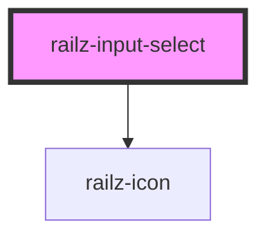

# railz-input-select

<!-- Auto Generated Below -->

## Properties

| Property            | Attribute            | Description | Type        | Default               |
| ------------------- | -------------------- | ----------- | ----------- | --------------------- |
| `dirty`             | `dirty`              |             | `boolean`   | `undefined`           |
| `disabled`          | `disabled`           |             | `boolean`   | `undefined`           |
| `error`             | `error`              |             | `boolean`   | `undefined`           |
| `errorMessage`      | `error-message`      |             | `string`    | `undefined`           |
| `instructionalText` | `instructional-text` |             | `string`    | `undefined`           |
| `label`             | `label`              |             | `string`    | `undefined`           |
| `name`              | `name`               |             | `string`    | `uuidv4().toString()` |
| `optionTemplate`    | --                   |             | `unknown[]` | `undefined`           |
| `options`           | --                   |             | `Option[]`  | `undefined`           |
| `partName`          | `part-name`          |             | `string`    | `undefined`           |
| `placeholder`       | `placeholder`        |             | `string`    | `undefined`           |
| `required`          | `required`           |             | `boolean`   | `undefined`           |
| `value`             | `value`              |             | `string`    | `undefined`           |

## Events

| Event         | Description | Type               |
| ------------- | ----------- | ------------------ |
| `valueChange` |             | `CustomEvent<any>` |

## Shadow Parts

| Part            | Description |
| --------------- | ----------- |
| `"option-item"` |             |

## Dependencies

### Depends on

- [railz-icon](../railz-icon)

### Graph

---

_Built with [StencilJS](https://stenciljs.com/)_
