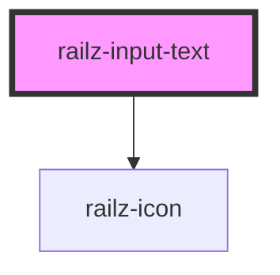

# railz-input-text

<!-- Auto Generated Below -->

## Properties

| Property            | Attribute            | Description | Type      | Default     |
| ------------------- | -------------------- | ----------- | --------- | ----------- |
| `autocomplete`      | `autocomplete`       |             | `string`  | `undefined` |
| `disabled`          | `disabled`           |             | `boolean` | `undefined` |
| `enterkeyhint`      | `enterkeyhint`       |             | `string`  | `undefined` |
| `error`             | `error`              |             | `boolean` | `undefined` |
| `errorMessage`      | `error-message`      |             | `string`  | `undefined` |
| `inputClassName`    | `input-class-name`   |             | `string`  | `undefined` |
| `inputId`           | `input-id`           |             | `string`  | `undefined` |
| `inputmode`         | `inputmode`          |             | `string`  | `undefined` |
| `instructionalText` | `instructional-text` |             | `string`  | `undefined` |
| `label`             | `label`              |             | `string`  | `undefined` |
| `maxContentLength`  | `max-content-length` |             | `number`  | `undefined` |
| `maxNumber`         | `max-number`         |             | `string`  | `undefined` |
| `minContentLength`  | `min-content-length` |             | `number`  | `undefined` |
| `minNumber`         | `min-number`         |             | `string`  | `undefined` |
| `pattern`           | `pattern`            |             | `string`  | `undefined` |
| `placeholder`       | `placeholder`        |             | `string`  | `undefined` |
| `prefixIcon`        | `prefix-icon`        |             | `string`  | `undefined` |
| `required`          | `required`           |             | `boolean` | `undefined` |
| `type`              | `type`               |             | `string`  | `undefined` |
| `value`             | `value`              |             | `string`  | `undefined` |

## Events

| Event         | Description | Type               |
| ------------- | ----------- | ------------------ |
| `valueChange` |             | `CustomEvent<any>` |

## Dependencies

### Depends on

- [railz-icon](../railz-icon)

### Graph

---

_Built with [StencilJS](https://stenciljs.com/)_
