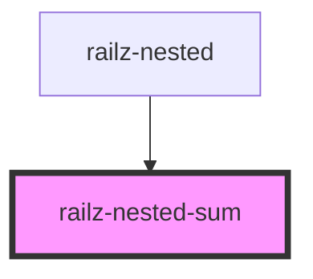

# railz-nested-sum

<!-- Auto Generated Below -->

## Usage

### Angular

```html
<railz-nested-sum :first.prop="12" second="10"></railz-nested-sum>
```

### React

```typescript jsx
import { RailzNested } from '@railzai/railz-uikit-react';

<RailzNested
  sumList={[
    { first: 12, second: 10 },
    { first: 40, second: 50 },
    { first: 2, second: 3 },
    { first: null, second: 3 },
  ]}
/>;
```

### Vue

```vue
<template>
  <railz-nested :sumList.prop="sumList"></railz-nested>
</template>

<script>
export default {
  name: 'Example',
  data() {
    return {
      sumList: [
        { first: 12, second: 10 },
        { first: 40, second: 50 },
        { first: 2, second: 3 },
        { first: null, second: 3 },
      ],
    };
  },
};
</script>
```

## Properties

| Property | Attribute | Description                | Type     | Default |
| -------- | --------- | -------------------------- | -------- | ------- |
| `first`  | `first`   | The first number to sum up | `number` | `0`     |
| `second` | `second`  | The second number          | `number` | `0`     |

## Dependencies

### Used by

- [railz-nested](../railz-nested)

### Graph



---

_Built with [StencilJS](https://stenciljs.com/)_
