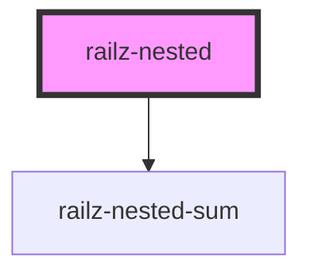

# railz-nested

<!-- Auto Generated Below -->

## Usage

### Angular

```html
<railz-nested-sum [first]="10" [second]="13"></railz-nested-sum>
```

### React

```typescript jsx
import { RailzNestedSum } from '@railzai/railz-uikit-react';

<RailzNestedSum first={10} second={14} />;
```

### Vue

```vue
<railz-nested-sum :first.prop="12" :second.prop="10"></railz-nested-sum>
```

## Properties

| Property  | Attribute | Description                   | Type    | Default |
| --------- | --------- | ----------------------------- | ------- | ------- |
| `sumList` | --        | The list of numbers to sum up | `Sum[]` | `[]`    |

## Dependencies

### Depends on

- [railz-nested-sum](../railz-nested-sum)

### Graph



---

_Built with [StencilJS](https://stenciljs.com/)_
