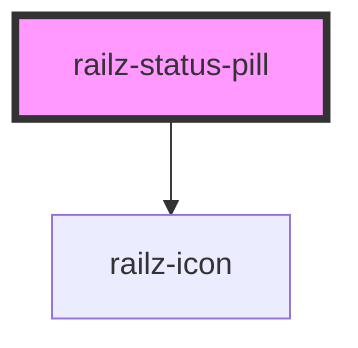

# railz-status-pill

<!-- Auto Generated Below -->

## Properties

| Property | Attribute | Description | Type     | Default     |
| -------- | --------- | ----------- | -------- | ----------- |
| `icon`   | `icon`    |             | `string` | `undefined` |
| `label`  | `label`   |             | `string` | `undefined` |
| `status` | `status`  |             | `string` | `undefined` |

## Dependencies

### Depends on

- [railz-icon](../railz-icon)

### Graph

---

_Built with [StencilJS](https://stenciljs.com/)_
