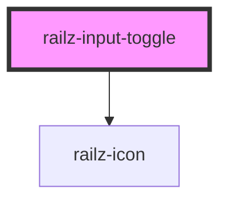

# railz-input-toggle

<!-- Auto Generated Below -->

## Properties

| Property            | Attribute            | Description | Type      | Default     |
| ------------------- | -------------------- | ----------- | --------- | ----------- |
| `checked`           | `checked`            |             | `boolean` | `undefined` |
| `disabled`          | `disabled`           |             | `boolean` | `undefined` |
| `error`             | `error`              |             | `boolean` | `undefined` |
| `errorMessage`      | `error-message`      |             | `string`  | `undefined` |
| `indeterminate`     | `indeterminate`      |             | `boolean` | `undefined` |
| `inputId`           | `input-id`           |             | `string`  | `undefined` |
| `instructionalText` | `instructional-text` |             | `string`  | `undefined` |
| `label`             | `label`              |             | `string`  | `undefined` |
| `name`              | `name`               |             | `string`  | `undefined` |
| `required`          | `required`           |             | `string`  | `undefined` |
| `value`             | `value`              |             | `string`  | `undefined` |

## Dependencies

### Depends on

- [railz-icon](../railz-icon)

### Graph

---

_Built with [StencilJS](https://stenciljs.com/)_
