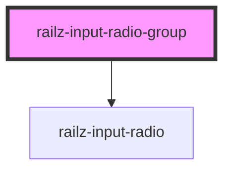

# railz-input-radio-group

<!-- Auto Generated Below -->

## Properties

| Property  | Attribute | Description | Type           | Default     |
| --------- | --------- | ----------- | -------------- | ----------- |
| `options` | --        |             | `RadioInput[]` | `undefined` |

## Dependencies

### Depends on

- [railz-input-radio](../railz-input-radio)

### Graph

----------------------------------------------

*Built with [StencilJS](https://stenciljs.com/)*
